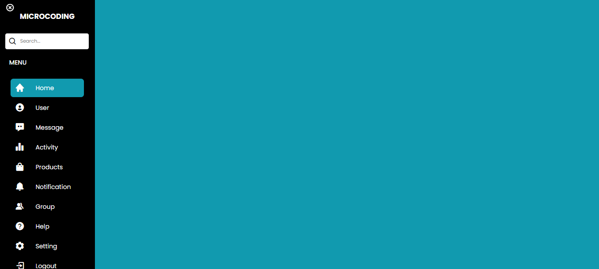

# MENU DE NAVEGACAO
💬INTERFACE DE MENU DE NAVEGAÇÃO COM ICONES!

  

## DESCRIÇÃO:
Este é um app em HTML e CSS que cria um aplicativo de navegação de menu responsivo. Aqui está uma descrição do que ele faz e como usá-lo:

1. **Menu de navegação lateral:** O aplicativo apresenta um menu de navegação lateral que pode ser aberto e fechado clicando no ícone do menu ou no ícone de fechar.
2. **Ícones e links:** Cada item do menu possui um ícone e um link correspondente.
3. **Pesquisa:** Há uma barra de pesquisa que permite ao usuário pesquisar dentro do aplicativo.
4. **Responsividade:** O aplicativo é projetado para se ajustar a diferentes tamanhos de tela, sendo responsivo tanto em dispositivos móveis quanto em desktops.

## COMO USAR?
1. **Abrir e fechar o menu:** Clique no ícone do menu (ícone de três linhas) para abrir o menu lateral. Clique no ícone de fechar (X) para fechar o menu.
2. **Navegar:** Clique nos links do menu para navegar para diferentes seções do aplicativo.
3. **Pesquisar:** Digite na barra de pesquisa para pesquisar conteúdo dentro do aplicativo.
4. **Responsividade:** O aplicativo se ajustará automaticamente para se adequar ao tamanho da tela do dispositivo. Experimente redimensionar a janela do navegador para ver como o layout responde.

## NÃO SABE?
- Entendemos que para manipular arquivos em `HTML`, `CSS` e outras linguagens relacionadas, é necessário possuir conhecimento nessas áreas. Para auxiliar nesse aprendizado, oferecemos cursos gratuitos disponíveis:
* [CURSO DE HTML E CSS](https://github.com/VILHALVA/CURSO-DE-HTML-E-CSS)
* [CONFIRA MAIS CURSOS](https://github.com/VILHALVA?tab=repositories&q=+topic:CURSO)

## CREDITOS:
- [PROJETO CRIADO PELO "MicroCoding"](https://drive.google.com/file/d/1KllqHr3KzYY9oZzxkZIIQl8HUW3t_KBo/view)
- [VEJA O VIDEO DESSE PROJETO](https://youtu.be/r4vjAjDE1N0?si=w6A06600-nr05tZl)
- [PROJETO EDITADO PELO VILHALVA](https://github.com/VILHALVA)